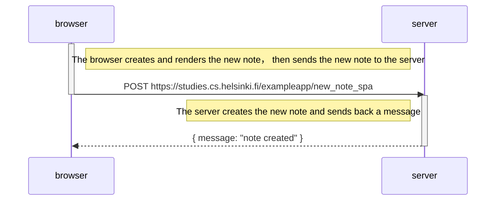

```mermaid
sequenceDiagram
    participant browser
    participant server

    activate browser
    Note right of browser: The browser creates and renders the new note， then sends the new note to the server
    browser->>server: POST https://studies.cs.helsinki.fi/exampleapp/new_note_spa
    deactivate browser

    activate server
    Note left of server: The server creates the new note and sends back a message
    server-->>browser: { message: "note created" }
    deactivate server
```
